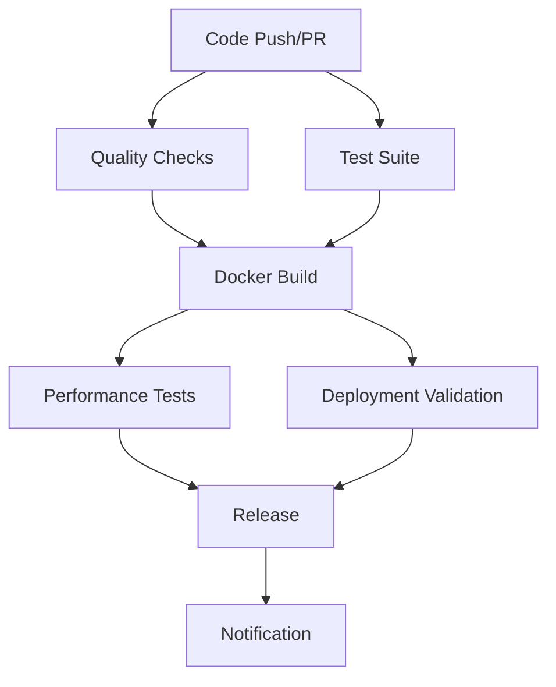

# CI/CD Pipeline Documentation

## Overview

The GlobeCo Order Generation Service uses a comprehensive CI/CD pipeline built with GitHub Actions to automate testing, building, security scanning, and deployment processes. The pipeline supports multi-architecture builds and includes robust deployment validation.

## Pipeline Architecture

### 1. Continuous Integration (`ci.yml`)

The CI pipeline is triggered on:
- Push to `main` and `develop` branches
- Pull requests to `main` and `develop`
- Git tags matching `v*` pattern
- Manual workflow dispatch

#### Pipeline Stages



#### Stage Details

1. **Quality Checks** (15 mins timeout)
   - Code formatting with Black
   - Import sorting with isort
   - Pre-commit hooks execution
   - Security scanning with Bandit
   - Artifact upload for security reports

2. **Test Suite** (30 mins timeout)
   - Multi-Python version testing (3.11, 3.12, 3.13)
   - MongoDB service integration
   - Unit and integration tests
   - Coverage reporting to Codecov
   - Test result artifacts

3. **Docker Build & Scan** (45 mins timeout)
   - Multi-architecture builds (AMD64/ARM64)
   - Docker Hub publishing (non-PR only)
   - Vulnerability scanning with Trivy
   - SBOM generation with Anchore
   - SARIF security report upload

4. **Performance Tests** (20 mins timeout, main/tags only)
   - Docker Compose test environment
   - API performance validation
   - Load testing scenarios
   - Performance metrics collection

5. **Release Management** (tags only)
   - Automatic changelog generation
   - GitHub release creation
   - Docker image documentation
   - Deployment instructions

6. **Deployment Validation** (main branch only)
   - Kubernetes manifest validation
   - Kustomize build validation
   - Security policy checks
   - Resource limit validation

### 2. Deployment Pipeline (`deploy.yml`)

Manual deployment workflow supporting:
- Environment selection (staging/production)
- Image tag specification
- Dry-run capability

#### Deployment Stages

1. **Pre-deployment Validation**
   - Input parameter validation
   - Docker image existence verification
   - Kubernetes manifest validation

2. **Environment-Specific Deployment**
   - Staging: `globeco-staging` namespace
   - Production: `globeco` namespace
   - Kustomize-based manifest processing
   - Rolling deployment with health checks

3. **Post-deployment Monitoring**
   - Deployment status verification
   - Health check validation
   - Performance monitoring setup

## Docker Hub Integration

### Repository Configuration

- **Repository**: `kasbench/globeco-order-generation-service`
- **Multi-architecture**: AMD64 and ARM64
- **Automated builds**: Triggered by CI pipeline
- **Security scanning**: Integrated with Trivy and Anchore

### Image Tagging Strategy

```bash
# Branch-based tags
main-sha123456       # Main branch commits
develop-sha789abc    # Develop branch commits

# Semantic version tags
v1.2.3              # Release tags
1.2                 # Major.minor
1                   # Major only

# Special tags
latest              # Latest main branch
pr-123              # Pull request builds
```

### Required Secrets

Configure these secrets in GitHub repository settings:

```bash
DOCKERHUB_USERNAME  # Docker Hub username
DOCKERHUB_TOKEN     # Docker Hub access token
CODECOV_TOKEN       # Codecov upload token (optional)
```

## Deployment Script Usage

### Universal Deployment Script

The `scripts/deploy.sh` script provides a unified interface for deployments:

```bash
# Basic deployment
./scripts/deploy.sh -e staging -t latest

# Production deployment
./scripts/deploy.sh -e production -t v1.2.3

# Dry run
./scripts/deploy.sh -e staging -t latest --dry-run

# Validation only
./scripts/deploy.sh --validate-only

# Rollback
./scripts/deploy.sh -e production --rollback

# Verbose output
./scripts/deploy.sh -e staging -t latest --verbose
```

#### Script Features

- **Multi-environment support**: Staging and production
- **Dry-run capability**: Test deployments without applying changes
- **Rollback functionality**: Automatic backup and rollback capability
- **Comprehensive validation**: Manifest, image, and prerequisite checks
- **Health monitoring**: Post-deployment verification
- **Colored output**: Clear status indication
- **Error handling**: Graceful failure with rollback suggestions

### Manual GitHub Actions Deployment

Use the GitHub Actions deployment workflow:

1. Navigate to Actions → Deploy to Kubernetes
2. Click "Run workflow"
3. Select:
   - Environment (staging/production)
   - Image tag (e.g., latest, v1.2.3)
   - Dry run option

## Environment Configuration

### Staging Environment

- **Namespace**: `globeco-staging`
- **URL**: `https://order-generation-staging.globeco.kasbench.org`
- **Resources**: Lower limits for cost optimization
- **Database**: Shared staging MongoDB instance

### Production Environment

- **Namespace**: `globeco`
- **URL**: `https://order-generation.globeco.kasbench.org`
- **Resources**: Production-optimized limits
- **Database**: Dedicated production MongoDB
- **High Availability**: Multi-replica deployment with HPA

## Performance Testing

### Integrated Performance Tests

The CI pipeline includes comprehensive performance validation:

```python
# Health endpoint performance
- Response time: <50ms average, <100ms P95
- Success rate: >99%
- Concurrent load: 10 simultaneous requests

# API endpoint performance
- Model listing: <200ms average
- Model creation: <500ms average
- Rebalancing: <5000ms average

# Load testing
- Mixed workload: 15-second duration
- Throughput: >10 requests/second
- Success rate: >90%
```

### Performance Benchmarking

Using pytest-benchmark for detailed performance analysis:

```bash
# Run performance tests locally
uv run pytest src/tests/performance/ -v

# Run with benchmarking
uv run pytest src/tests/performance/ --benchmark-only
```

## Security Integration

### Vulnerability Scanning

Multi-layered security scanning approach:

1. **Source Code Scanning**
   - Bandit for Python security issues
   - Pre-commit hooks for secrets detection

2. **Container Scanning**
   - Trivy for OS and dependency vulnerabilities
   - SARIF integration with GitHub Security tab

3. **Supply Chain Security**
   - SBOM generation in SPDX format
   - Dependency tracking and analysis

### Security Policies

Kubernetes security validation includes:

```bash
# Security context validation
runAsNonRoot: true
readOnlyRootFilesystem: true
capabilities.drop: ["ALL"]

# Resource limits enforcement
resources.limits.cpu: defined
resources.limits.memory: defined
resources.requests.cpu: defined
resources.requests.memory: defined
```

## Monitoring and Observability

### Health Endpoints

Comprehensive health monitoring:

```bash
# Kubernetes health checks
/health/live    # Liveness probe
/health/ready   # Readiness probe
/health/health  # Comprehensive status

# Application monitoring
/metrics        # Prometheus metrics
/docs          # API documentation
/openapi.json  # OpenAPI specification
```

### Deployment Monitoring

Post-deployment monitoring includes:

- Pod status and restart counts
- Service endpoint availability
- Resource utilization monitoring
- Application health endpoint validation
- Performance baseline establishment

## Troubleshooting

### Common Issues

1. **Docker Hub Authentication**
   ```bash
   # Verify secrets are configured
   echo $DOCKERHUB_USERNAME
   echo $DOCKERHUB_TOKEN
   ```

2. **Kubernetes Access**
   ```bash
   # Check kubectl configuration
   kubectl cluster-info
   kubectl get nodes
   ```

3. **Image Pull Issues**
   ```bash
   # Verify image exists
   docker manifest inspect kasbench/globeco-order-generation-service:latest
   ```

4. **Deployment Failures**
   ```bash
   # Check deployment status
   kubectl get deployments -n globeco
   kubectl describe deployment globeco-order-generation-service -n globeco
   kubectl logs -n globeco -l app=globeco-order-generation-service
   ```

### Rollback Procedures

#### Automatic Rollback
```bash
# Using deployment script
./scripts/deploy.sh -e production --rollback
```

#### Manual Rollback
```bash
# Using kubectl
kubectl rollout undo deployment/globeco-order-generation-service -n globeco

# Check rollout status
kubectl rollout status deployment/globeco-order-generation-service -n globeco
```

### Pipeline Debugging

1. **CI/CD Logs**: Check GitHub Actions logs for detailed error information
2. **Artifact Downloads**: Download test results and security reports
3. **Debug Mode**: Use workflow dispatch with verbose logging
4. **Local Testing**: Run deployment script locally with `--dry-run`

## Performance Benchmarks

### Baseline Performance Metrics

```yaml
Health Endpoints:
  - Liveness: <10ms average, >99.9% success rate
  - Readiness: <50ms average, >99% success rate
  - Health: <100ms average, >99% success rate

API Endpoints:
  - Model List: <200ms P95, >95% success rate
  - Model Create: <500ms P95, >90% success rate
  - Model Update: <300ms P95, >95% success rate
  - Rebalancing: <5000ms P95, >80% success rate

Load Testing:
  - Concurrent Users: 10-50 simultaneous
  - Throughput: 50-100 requests/second
  - Success Rate: >95% under normal load
```

### SLA Targets

```yaml
Availability: 99.9% uptime
Response Time:
  - Read Operations: <200ms P95
  - Write Operations: <500ms P95
  - Complex Operations: <5000ms P95
Throughput: 100+ requests/second
Error Rate: <1% under normal load
```

## Best Practices

### Development Workflow

1. **Feature Development**
   - Create feature branch from `develop`
   - Implement with comprehensive tests
   - Submit PR for code review
   - CI pipeline validates changes

2. **Release Process**
   - Merge to `main` branch
   - Tag release with semantic version
   - Automatic Docker build and publish
   - Deploy to staging for validation
   - Manual production deployment

3. **Hotfix Process**
   - Create hotfix branch from `main`
   - Implement critical fix with tests
   - Fast-track through review process
   - Tag hotfix release
   - Emergency deployment with rollback plan

### Deployment Best Practices

1. **Pre-deployment Checklist**
   - [ ] All tests passing
   - [ ] Security scans clean
   - [ ] Performance benchmarks met
   - [ ] Documentation updated
   - [ ] Rollback plan prepared

2. **Deployment Execution**
   - [ ] Deploy to staging first
   - [ ] Validate staging deployment
   - [ ] Execute production deployment
   - [ ] Monitor deployment progress
   - [ ] Validate production health

3. **Post-deployment Validation**
   - [ ] Health checks passing
   - [ ] Performance within SLA
   - [ ] Error rates normal
   - [ ] Monitoring alerts configured
   - [ ] Documentation updated

## Configuration Management

### Environment Variables

Key configuration parameters:

```yaml
# Application Configuration
PORT: 8080
MONGODB_URL: "mongodb://..."
OPTIMIZATION_TIMEOUT: 30

# External Services
PORTFOLIO_ACCOUNTING_URL: "http://portfolio-accounting:8087"
PRICING_SERVICE_URL: "http://pricing-service:8083"
PORTFOLIO_SERVICE_URL: "http://portfolio-service:8000"

# Performance Tuning
WORKER_PROCESSES: 4
MAX_CONNECTIONS: 1000
REQUEST_TIMEOUT: 30
```

### Kubernetes Configuration

Managed through Kustomize overlays:

```yaml
# Base configuration (deployments/)
- deployment.yaml
- service.yaml
- configmap.yaml
- secrets.yaml

# Environment-specific patches
- patches/staging-resources.yaml
- patches/production-resources.yaml
```

This comprehensive CI/CD pipeline ensures reliable, secure, and performant deployments while maintaining operational excellence for the KasBench research platform.
